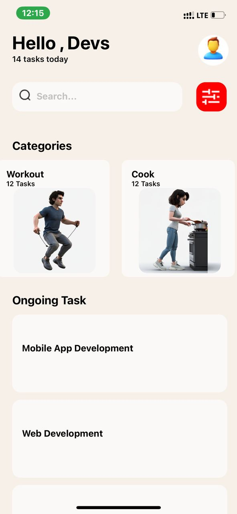
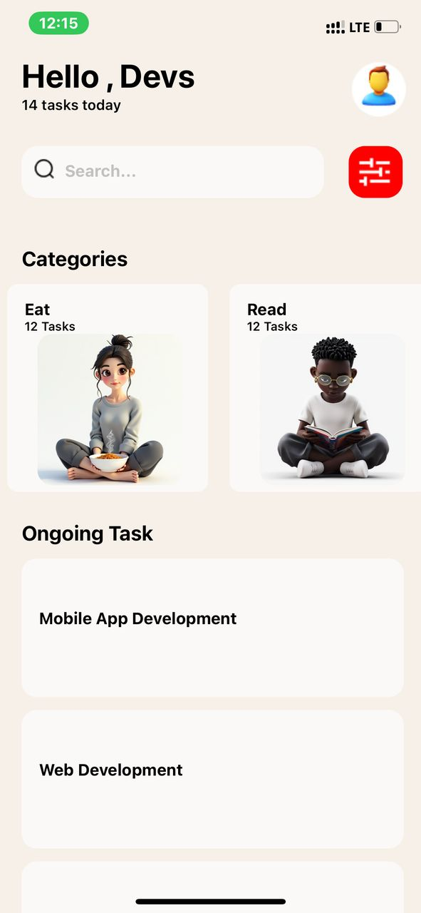
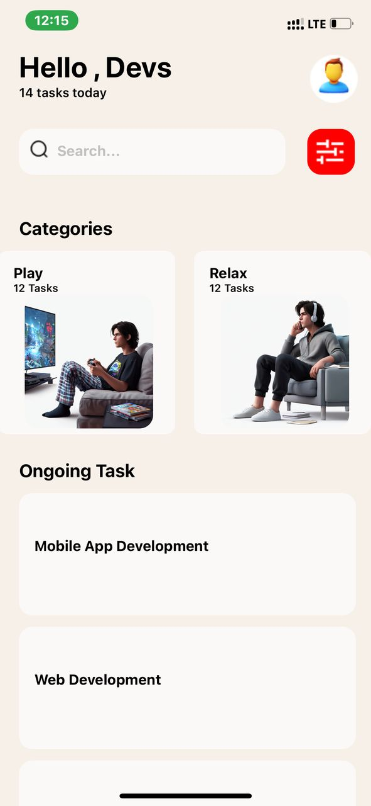
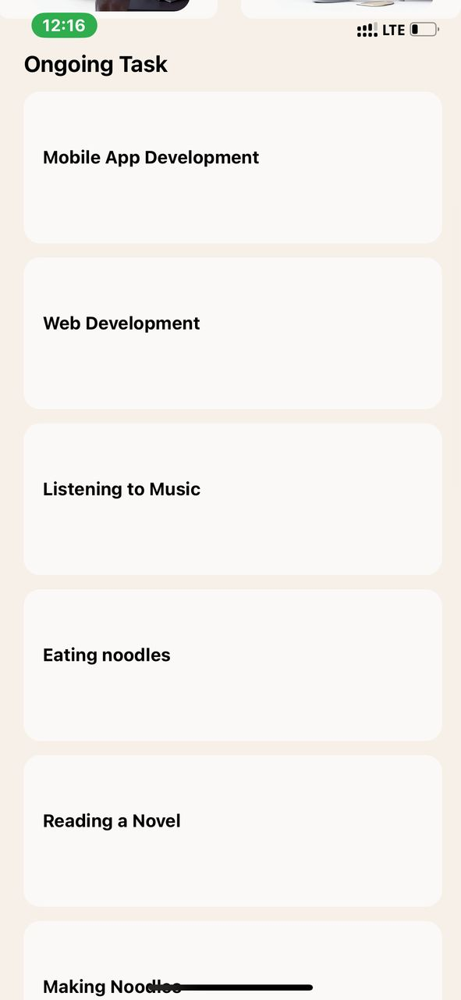
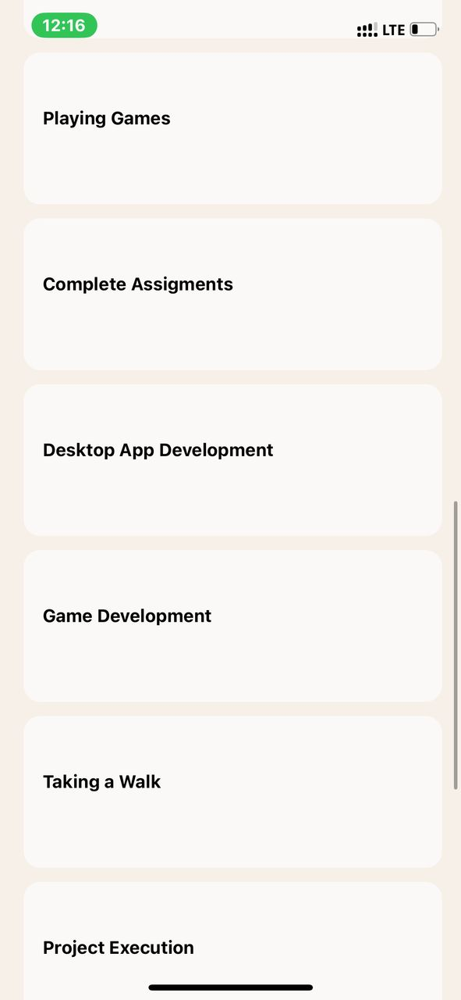
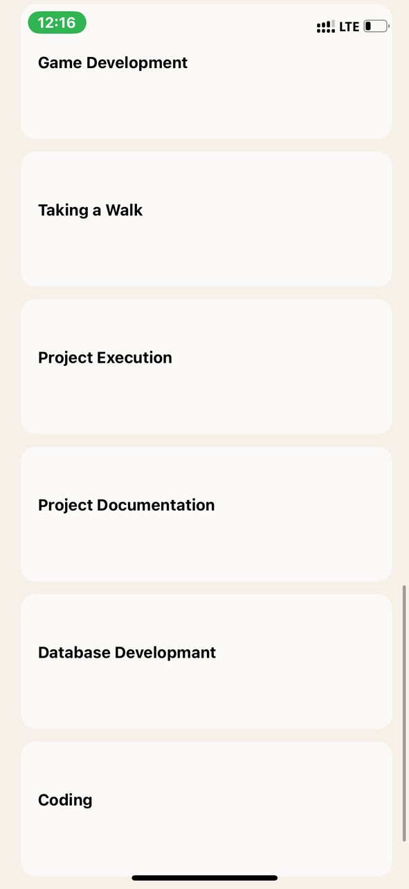

# React Native Assignment 
## Components used and their functionalities
- **View**: The most fundamental component for building a UI. Acts as a container for other components and its used for layout structuring.

- **Text**: A component for displaying text content. Used for labels, headings and discriptions.

- **Image**: A compont for displaying images in the app. Used for logos, icons and user profile pictures.

- **TextInput**: A component which allows user input. Used in forms, search bars, and login fields.

- **ScrollView**: Provides a scrolling container that can host multiple components and views.

- **StyleSheet**: Provides an abstraction layer similar to css stylesheets.

- **FlatList**: A component for rendering performant scrollable lists.

SCREENSHOTS

